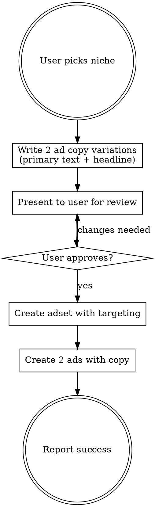

# Sharpify English Ad Creator — B2B Playbook

Create niche-targeted Meta ads for Sharpify's B2B Client Acquisition Playbook (eu.sharpify.lv/ms/) — text-only ads targeting English-speaking business owners by industry niche.

## Workflow



## FIRST STEP (always)

Before doing anything else, read IN ORDER:
1. **`sharpify/CLAUDE.md`** — Sharpify cross-language rules (brand palette, video workflow)
2. **`sharpify/eng/CLAUDE.md`** — ENG-specific rules (Playbook not free, Website Offer pricing, no unverified stars, two-product split)
3. **`sharpify/notes.md`** — cross-language learnings
4. **`sharpify/eng/notes.md`** — ENG-specific learnings
5. **`sharpify/formats/*.md`** — proven formats (some LV-specific — check applicability)

When the user gives feedback this session, append to the right workspace:
- ENG-only learning → `sharpify/eng/notes.md`
- Cross-language (also applies to LV) → `sharpify/notes.md`
- New proven format → create a file in `sharpify/formats/` and reference it here

You CAN read `sharpify/lv/` when the user asks to clone ads across languages.

**Output path:** all ENG ad outputs go to `sharpify/eng/output/{niche-or-product}/`.

## VIDEO ADS — use `remotion-superpowers` plugin

When the user asks for **video ads** (not text-only) for the ENG account — triggers like "make video ads for [niche]", "ENG video ads", "Remotion ads" — delegate to the `remotion-superpowers` plugin. Don't hand-code Remotion components.

### Video workflow (ENG)

1. **Read `notes.md` + this skill + CLAUDE.md §4.4** (you should have done this already).

2. **Clarify which ENG product the video promotes:**
   - **B2B Playbook** (`eu.sharpify.lv/ms/`) — lead-gen for consultants/coaches/agencies. Long-form empathetic tone.
   - **Website Offer** (`web.sharpify.lv`) — direct purchase at €299→€59 for solo founders/trades/local services. Scrappier, more direct tone.
   Different product = different script framing. Ask the user if unclear.

3. **Write the 4-scene script in English** using our proven structure:
   - **Scene 1 — HOOK (3s):** Identity question / pain statement the target audience instantly recognizes ("Still relying on referrals to fill your calendar?"). NOT generic cinematic b-roll.
   - **Scene 2 — PROBLEM/DEMO (4-5s):** Show the pain — inconsistent revenue, posting without leads, manual follow-up. UGC-style phone footage, split-screen before/after.
   - **Scene 3 — PROOF/DETAILS (3-4s):** Real credibility numbers — "2,300+ businesses", "€50M+ generated", case study mention. Never claim unverified stars/ratings (per ENG notes.md rule).
   - **Scene 4 — CTA (3s):** Product-specific close:
     - Playbook: "Download the Playbook" + eu.sharpify.lv/ms
     - Website Offer: "Get yours for €59" + web.sharpify.lv

4. **Delegate to the plugin** — use ONE of these approaches:

   **Full-auto path:** Invoke the `video-director` agent with the 4-scene script + tone/style notes.

   **Manual control path:**
   - `/find-footage` or `media-scout` agent — source niche-relevant clips
   - `/create-video` — build the 4-scene structure
   - `/add-voiceover` — AI voice in English (native speaker, match the target market — US/UK/AU depending on campaign geo)
   - `/add-music` — match the tone (confident/authoritative for Playbook, practical/urgent for Website Offer)
   - `/add-captions` — clean English subtitles (auto-scroll at comfortable reading pace)
   - `/add-transitions` — clean cuts, no cheap flashes
   - `/review-video` — post-producer AI review

5. **Strict ENG Sharpify video rules:**
   - No "FREE Playbook" language ever — Playbook is paid (per CLAUDE.md §3)
   - Website bonus CAN say "Free website included" — it IS free (LV and ENG MS funnel)
   - No fake reviews or unverified star ratings
   - Brand palette matches the LV rules: yellow `#E8D500`, black `#0a0a0a`, white, red price slash, green savings
   - CTA button uses "Download", "Get Started", "Get the Playbook" — match Meta CTA button library
   - No interface mockups as the core format (ChatGPT/Google/iMessage fatigue fast at scale per CLAUDE.md §4)

6. **Output destination:** save rendered MP4 to `output/sharpify-eng/videos/{niche}-{product}-v{n}.mp4`.

7. **Present to user for approval before Meta upload** (never launch without explicit OK).

### Fallback if plugin fails
Fall back to hand-coded Remotion using the existing `remotion-videos/` project. Flag the fallback to the user so they know they're getting a lower-polish version without AI voiceover.

For **text-only static ads** (the default ENG workflow), follow the pipeline below.

## CRITICAL RULES

1. **NEVER launch to Meta without explicit user approval** — always present copy first and ask
2. **Each ad must have UNIQUE text** — never duplicate headlines or primary text across ads in same adset
3. **No "B2B" language in ads** — target audience are business owners, they already know they need clients
4. **The Playbook is NOT free** — never use "free", "free playbook", "free training" in ad copy. Use value-focused language: "Download the playbook", "Get the playbook", "Get instant access"
5. **Always use English account** (act_1184056475376090) for English language ads
6. **Text-only ads** — no image creatives, no HTML generation, no PNG export. Just ad copy + Meta API launch

## Meta API Details

- **Account:** act_1184056475376090 (ENG)
- **Page ID:** 116359515734204
- **Instagram:** 17841401853795292
- **Campaign:** B2B Playbook Magnet - qualification funnel - 31.03
- **API version:** v21.0
- **Landing page:** https://eu.sharpify.lv/ms/

## Step 1: Write Ad Copy

All ads are in English, from Niks Jansons / Sharpify brand perspective.

### Primary text structure (2 variations per niche):

**v1 — Pain point checklist style:**
```
Are you a {niche professional} who's great at what you do — but still relying on referrals to fill your calendar?

You're not alone. Most {niche professionals} hit the same wall:

✅ Clients come from word-of-mouth, but it's unpredictable
✅ {Niche-specific pain point — tried marketing but no results}
✅ Revenue is stuck at the same level for months
✅ You know you could handle more clients, but they're not coming

We put together a playbook that shows the exact system 2,300+ businesses use to get qualified clients reaching out every day.

Inside you'll find:
🔹 How to create an offer that stands out from every other {niche professional}
🔹 The marketing system that brings 1-10 leads daily on autopilot
🔹 How AI handles follow-ups while you focus on {core niche activity}
🔹 Real case studies from {niche professionals} who scaled past €10K/month

Download the playbook — no email sequences, just the system.

Niks Jansons, CEO @ Sharpify
```

**v2 — Question hook / storytelling style:**
```
What would you do if {X qualified leads} reached out to you every single week?

{2-3 sentences about the niche's current client acquisition problem — why referrals, posting, and cold outreach aren't working}

The playbook breaks down the exact system we've built for 2,300+ businesses:

🔹 An offer framework that makes {niche professionals} stand out instantly
🔹 A marketing engine that generates 1-10 inbound leads per day
🔹 AI-powered follow-up that nurtures leads while you {niche-specific activity}
🔹 CRM setup so no lead ever falls through the cracks

Our clients have collectively generated €50M+ in revenue. Download it below.

Niks Jansons, CEO @ Sharpify
```

### Headline (below image area in Facebook):
- v1: Niche-specific hook + "Download the Playbook 👉"
- v2: Different angle, e.g., "The system that books clients for you 👉"

### CTA button: Always "Learn More"

### Key messaging points:
- Exact system used by 2,300+ businesses
- 1-10 qualified leads per day on autopilot
- AI-powered follow-up and nurturing
- CRM so no lead falls through the cracks
- €50M+ collective client revenue
- No email sequences — just the system

## Step 2: Present for Review

Show the user both ad variations in a clear format:

```
=== AD 1 (Pain Point Checklist) ===
PRIMARY TEXT:
{full primary text}

HEADLINE: {headline}
CTA: Learn More

=== AD 2 (Question Hook) ===
PRIMARY TEXT:
{full primary text}

HEADLINE: {headline}
CTA: Learn More
```

Ask: "Ready to launch these? Or any changes needed?"

## Step 3: Launch on Meta

**Only after user explicitly approves.**

### Create adset:
- **No daily_budget** — campaign uses campaign-level budget
- **destination_type=WEBSITE** — links to eu.sharpify.lv/ms/
- **optimization_goal=LINK_CLICKS** or **LANDING_PAGE_VIEWS** (confirm with user)
- **billing_event=IMPRESSIONS**
- **targeting:** niche interests + Small business owners behavior + target countries + English locale
- **advantage_audience=0** — disable Advantage+ to keep targeting precise
- **Platforms:** facebook + instagram, all positions

### Targeting patterns:
| Niche | Gender | Interests | Behaviors |
|---|---|---|---|
| Coaches | Both | Life coaching, Business coaching, Executive coaching | Small business owners |
| Consultants | Both | Management consulting, Business consulting | Small business owners |
| Agencies | Both | Digital marketing, Marketing agency, Advertising | Small business owners |
| Fitness/PT | Both | Personal training, Fitness, Gym | Small business owners |
| Real estate | Both | Real estate, Real estate agent | Small business owners |
| Trades/Home services | Male | Home improvement, Plumbing, Electrical, HVAC | Small business owners |
| Beauty/Wellness | Female | Beauty salons, Spa, Aesthetics | Small business owners |

### Create ads (use Python urllib for proper encoding):
```python
import json, urllib.request, urllib.parse
creative = json.dumps({
    'object_story_spec': {
        'page_id': '116359515734204',
        'instagram_user_id': '17841401853795292',
        'link_data': {
            'link': 'https://eu.sharpify.lv/ms/',
            'message': '{primary_text}',
            'name': '{headline}',
            'description': 'Sharpify — Client Acquisition System',
            'call_to_action': {
                'type': 'LEARN_MORE',
                'value': {'link': 'https://eu.sharpify.lv/ms/'}
            }
        }
    }
})
data = urllib.parse.urlencode({
    'name': '{ad_name}',
    'adset_id': '{adset_id}',
    'status': 'ACTIVE',
    'creative': creative,
    'access_token': '{token}'
}).encode()
req = urllib.request.Request(
    'https://graph.facebook.com/v21.0/act_1184056475376090/ads',
    data=data, method='POST')
```

**Note:** No image upload needed — these are text/link ads. The link preview image comes from the landing page automatically.

## Common Mistakes

- **Saying "free playbook"** — the playbook is NOT free. Never use "free" in any form
- **Duplicate text across ads** — each ad MUST have unique primary text + headline
- **Launching without approval** — always present and wait for explicit go-ahead
- **Using "B2B" in ad copy** — target audience are business people, not B2B jargon fans
- **Using LV account for English ads** — always use act_1184056475376090 for English
- **Adding decorative emojis** — only ✅ (pain points) and 🔹 (features) allowed
- **Using curl -F for ad creation** — special characters break encoding, use Python urllib
