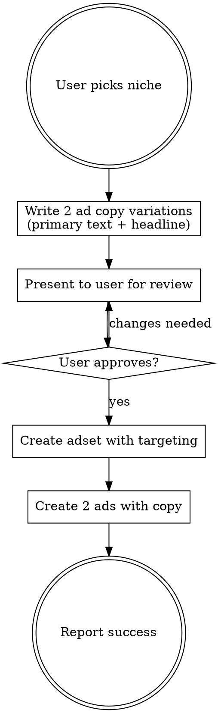

# Sharpify English Ad Creator — B2B Playbook

Create niche-targeted Meta ads for Sharpify's B2B Client Acquisition Playbook (eu.sharpify.lv/ms/) — text-only ads targeting English-speaking business owners by industry niche.

## Workflow



## FIRST STEP (always)

Before doing anything else, **read `notes.md`** (sibling file in this skill directory). It contains workflow-specific learnings accumulated from past sessions — style patterns, niche-specific rules, targeting preferences, mistakes to avoid.

When the user gives feedback or corrections during this session, **append it to `notes.md`** using the format defined in that file. This is how the system gets smarter over time without you having to re-explain.

## CRITICAL RULES

1. **NEVER launch to Meta without explicit user approval** — always present copy first and ask
2. **Each ad must have UNIQUE text** — never duplicate headlines or primary text across ads in same adset
3. **No "B2B" language in ads** — target audience are business owners, they already know they need clients
4. **The Playbook is NOT free** — never use "free", "free playbook", "free training" in ad copy. Use value-focused language: "Download the playbook", "Get the playbook", "Get instant access"
5. **Always use English account** (act_1184056475376090) for English language ads
6. **Text-only ads** — no image creatives, no HTML generation, no PNG export. Just ad copy + Meta API launch

## Meta API Details

- **Account:** act_1184056475376090 (ENG)
- **Page ID:** 116359515734204
- **Instagram:** 17841401853795292
- **Campaign:** B2B Playbook Magnet - qualification funnel - 31.03
- **API version:** v21.0
- **Landing page:** https://eu.sharpify.lv/ms/

## Step 1: Write Ad Copy

All ads are in English, from Niks Jansons / Sharpify brand perspective.

### Primary text structure (2 variations per niche):

**v1 — Pain point checklist style:**
```
Are you a {niche professional} who's great at what you do — but still relying on referrals to fill your calendar?

You're not alone. Most {niche professionals} hit the same wall:

✅ Clients come from word-of-mouth, but it's unpredictable
✅ {Niche-specific pain point — tried marketing but no results}
✅ Revenue is stuck at the same level for months
✅ You know you could handle more clients, but they're not coming

We put together a playbook that shows the exact system 2,300+ businesses use to get qualified clients reaching out every day.

Inside you'll find:
🔹 How to create an offer that stands out from every other {niche professional}
🔹 The marketing system that brings 1-10 leads daily on autopilot
🔹 How AI handles follow-ups while you focus on {core niche activity}
🔹 Real case studies from {niche professionals} who scaled past €10K/month

Download the playbook — no email sequences, just the system.

Niks Jansons, CEO @ Sharpify
```

**v2 — Question hook / storytelling style:**
```
What would you do if {X qualified leads} reached out to you every single week?

{2-3 sentences about the niche's current client acquisition problem — why referrals, posting, and cold outreach aren't working}

The playbook breaks down the exact system we've built for 2,300+ businesses:

🔹 An offer framework that makes {niche professionals} stand out instantly
🔹 A marketing engine that generates 1-10 inbound leads per day
🔹 AI-powered follow-up that nurtures leads while you {niche-specific activity}
🔹 CRM setup so no lead ever falls through the cracks

Our clients have collectively generated €50M+ in revenue. Download it below.

Niks Jansons, CEO @ Sharpify
```

### Headline (below image area in Facebook):
- v1: Niche-specific hook + "Download the Playbook 👉"
- v2: Different angle, e.g., "The system that books clients for you 👉"

### CTA button: Always "Learn More"

### Key messaging points:
- Exact system used by 2,300+ businesses
- 1-10 qualified leads per day on autopilot
- AI-powered follow-up and nurturing
- CRM so no lead falls through the cracks
- €50M+ collective client revenue
- No email sequences — just the system

## Step 2: Present for Review

Show the user both ad variations in a clear format:

```
=== AD 1 (Pain Point Checklist) ===
PRIMARY TEXT:
{full primary text}

HEADLINE: {headline}
CTA: Learn More

=== AD 2 (Question Hook) ===
PRIMARY TEXT:
{full primary text}

HEADLINE: {headline}
CTA: Learn More
```

Ask: "Ready to launch these? Or any changes needed?"

## Step 3: Launch on Meta

**Only after user explicitly approves.**

### Create adset:
- **No daily_budget** — campaign uses campaign-level budget
- **destination_type=WEBSITE** — links to eu.sharpify.lv/ms/
- **optimization_goal=LINK_CLICKS** or **LANDING_PAGE_VIEWS** (confirm with user)
- **billing_event=IMPRESSIONS**
- **targeting:** niche interests + Small business owners behavior + target countries + English locale
- **advantage_audience=0** — disable Advantage+ to keep targeting precise
- **Platforms:** facebook + instagram, all positions

### Targeting patterns:
| Niche | Gender | Interests | Behaviors |
|---|---|---|---|
| Coaches | Both | Life coaching, Business coaching, Executive coaching | Small business owners |
| Consultants | Both | Management consulting, Business consulting | Small business owners |
| Agencies | Both | Digital marketing, Marketing agency, Advertising | Small business owners |
| Fitness/PT | Both | Personal training, Fitness, Gym | Small business owners |
| Real estate | Both | Real estate, Real estate agent | Small business owners |
| Trades/Home services | Male | Home improvement, Plumbing, Electrical, HVAC | Small business owners |
| Beauty/Wellness | Female | Beauty salons, Spa, Aesthetics | Small business owners |

### Create ads (use Python urllib for proper encoding):
```python
import json, urllib.request, urllib.parse
creative = json.dumps({
    'object_story_spec': {
        'page_id': '116359515734204',
        'instagram_user_id': '17841401853795292',
        'link_data': {
            'link': 'https://eu.sharpify.lv/ms/',
            'message': '{primary_text}',
            'name': '{headline}',
            'description': 'Sharpify — Client Acquisition System',
            'call_to_action': {
                'type': 'LEARN_MORE',
                'value': {'link': 'https://eu.sharpify.lv/ms/'}
            }
        }
    }
})
data = urllib.parse.urlencode({
    'name': '{ad_name}',
    'adset_id': '{adset_id}',
    'status': 'ACTIVE',
    'creative': creative,
    'access_token': '{token}'
}).encode()
req = urllib.request.Request(
    'https://graph.facebook.com/v21.0/act_1184056475376090/ads',
    data=data, method='POST')
```

**Note:** No image upload needed — these are text/link ads. The link preview image comes from the landing page automatically.

## Common Mistakes

- **Saying "free playbook"** — the playbook is NOT free. Never use "free" in any form
- **Duplicate text across ads** — each ad MUST have unique primary text + headline
- **Launching without approval** — always present and wait for explicit go-ahead
- **Using "B2B" in ad copy** — target audience are business people, not B2B jargon fans
- **Using LV account for English ads** — always use act_1184056475376090 for English
- **Adding decorative emojis** — only ✅ (pain points) and 🔹 (features) allowed
- **Using curl -F for ad creation** — special characters break encoding, use Python urllib
