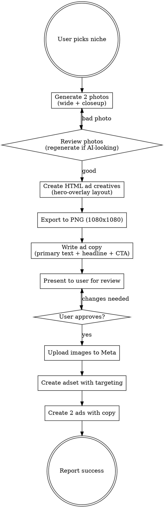

# Sharpify Meta Ad Creator

Create niche-targeted Meta lead gen ads for Sharpify (Niks Jansons) — from image generation to live campaign launch.

## Workflow



## FIRST STEP (always)

Before doing anything else, **read `notes.md`** (sibling file in this skill directory). It contains workflow-specific learnings accumulated from past sessions — style patterns, niche-specific rules, targeting preferences, mistakes to avoid.

When the user gives feedback or corrections during this session, **append it to `notes.md`** using the format defined in that file. This is how the system gets smarter over time without you having to re-explain.

## VIDEO ADS — use `remotion-superpowers` plugin

When the user asks for **video ads** (not static images) for the LV account — triggers like "make video ads for [niche]", "video reklāmas", "Remotion ads" — delegate to the `remotion-superpowers` plugin. Don't hand-code Remotion components.

Video hits 3-5% CTR vs 1-2% for static (per account history), so prefer video when budget allows.

### Video workflow (LV)

1. **Read `notes.md` + this skill + CLAUDE.md §4.4** (you should have done this already).

2. **Confirm the niche and core message with the user** if not provided. Pull niche-specific pain points from notes.md or past winners (e.g., "Salona īpašniece" formula, "Tu parūpējies, lai..." framing).

3. **Write the 4-scene script** in Latvian using our proven structure:
   - **Scene 1 — HOOK (3s):** Pattern interrupt. Niche-specific question or bold claim. NOT generic cinematic b-roll (per `feedback_veo_no_generic_cinematic.md`). Examples: "Kamēr tu [activity], nākamais klients paiet garām konkurentiem." / "5 būvnieki Rīgā jau izmanto šo sistēmu."
   - **Scene 2 — PROBLEM/DEMO (4-5s):** Show the pain — client acquisition gap, manual follow-up, referrals running dry. Visual: UGC/phone footage, split-screen, screen recording of empty calendar.
   - **Scene 3 — PROOF/DETAILS (3-4s):** Real numbers ("2'300+ uzņēmēji", "€50m+ apgrozījumu", "1-10 klienti dienā"). Notification stack, dashboard screen, client testimonial card.
   - **Scene 4 — PRICE + CTA (3s):** MP Risinājums system + "Piesakies zemāk" + lead form URL.

4. **Delegate to the plugin** — use ONE of these approaches depending on scope:

   **Full-auto path (fastest):** Invoke the `video-director` agent with the 4-scene script + tone/style notes. It orchestrates media-scout (footage) + post-producer (transitions, polish) + review.

   **Manual control path (more precision):**
   - `/find-footage` — source niche-relevant stock clips (or use `media-scout` agent for curated picks)
   - `/create-video` — build the 4-scene structure with timings
   - `/add-voiceover` — AI voice in Latvian (specify male/female, tone). Use `generate_speech` MCP for specific control.
   - `/add-music` — match the tone (dramatic for warning ads, upbeat for prosperity/success ads). Strict Sharpify palette applies — avoid trendy synthwave if the niche is trades/industrial.
   - `/add-captions` — TikTok-style Latvian subtitles, all-caps bold yellow-on-black
   - `/add-transitions` — cuts/wipes, never cheap white flashes (per notes.md rule)
   - `/review-video` — run the post-producer AI review. Iterate on flagged weaknesses.

5. **Strict Sharpify video rules** (enforce through every step):
   - Brand palette only: yellow `#E8D500`, black `#0a0a0a`, white, red `#FF3344` for price slash, green `#22C55E` for savings. Never trendy purple/pink.
   - No generic cinematic b-roll (handshakes, typing montages). Pattern interrupt in first 0.5-1s.
   - Scale text big: headlines 56-72px equivalent, CTA button ≥48px. Phone-feed viewable at 40% thumbnail.
   - CTA button on final scene uses "Piesakies" / "Uzzināt vairāk" — NOT "Learn More" (English).

6. **Output destination:** save rendered MP4 to `output/sharpify-leadgen/videos/{niche}-v{n}.mp4` or `remotion-videos/out/{niche}-{timestamp}.mp4` depending on setup.

7. **Present to user for approval before Meta upload** (same as static ads — never launch without explicit OK).

### Fallback if plugin fails
If `remotion-superpowers` is unavailable mid-render, fall back to hand-coded Remotion using the existing `remotion-videos/` project — the 4-scene structure in `AIToolkitProShowcase.tsx` is the proven reference. Flag the fallback to the user so they know they're getting a lower-polish version without AI voiceover.

For **static image ads**, follow the image pipeline below (Steps 1-5).

## CRITICAL RULES

1. **NEVER launch to Meta without explicit user approval** — always present creatives + copy first and ask
2. **Each ad must have UNIQUE text** — never duplicate headlines or body text across ads in same adset
3. **No "B2B" language in ads** — target audience are business owners, they already know they need clients
4. **Avoid cringe phrases** — no "ieslēgt/izslēgt kā krānu", keep copy natural and professional
5. **Always use Latvian account** (act_549172712351324) for Latvian language ads
6. **Photos must look real** — if AI-generated photo looks fake, regenerate with more documentary/candid prompts
7. **Use direct lead form, not quiz landing page** — account history confirms quiz funnels produce 0 leads across €35+ spend on 4 niches. Default to Meta's native lead gen form (ID `944838491325482`) with `destination_type=ON_AD`.

## Project Paths

- **Generator root:** `c:/Users/Ritvars Volfs/meta-ad-generator-v2/meta-ad-generator/`
- **Export script:** `scripts/export-png.js`
- **Image generator:** `scripts/generate-image.js` (Gemini Imagen 4)
- **Output pattern:** `output/niks-{niche}/images/`, `output/niks-{niche}/html/`, `output/niks-{niche}/png/`
- **API keys:** `.env` in project root (GEMINI_API_KEY, META_ACCESS_TOKEN)

## Step 1: Generate Photos

Generate 2 images per niche using Gemini Imagen 4:

**v1 — Wide/environmental shot:** Workers in action, showing the trade. Documentary candid style.
**v2 — Close-up/detail shot:** Hands doing the work, tools, materials. Shallow depth of field.

### Prompt tips for realistic photos:
- "Documentary-style photograph" or "Professional construction photography"
- "Candid unposed moment" — avoids stock photo feel
- "Slightly desaturated colors" or "natural muted colors"
- "35mm lens" — gives natural perspective
- Always end with "No text, no logos"
- If result looks AI-generated, add "overcast sky", "muddy/gritty", "raw" to prompt

```bash
node scripts/generate-image.js "<prompt>" "output/niks-{niche}/images/{name}.png"
```

## Step 2: Create HTML Ad Creatives

Use hero-overlay layout. Each ad gets unique headline + body text.

### Color accents by niche type:
| Niche type | Accent color | Hex |
|---|---|---|
| Construction/trades | Warm amber | #F59E0B |
| Beauty/wellness | Warm gold | #E8A838 |
| IT/tech | Blue | #3B82F6 |
| Security | Indigo/violet | #6366F1 |
| General services | Amber | #F59E0B |

### HTML template structure:
- 1080x1080 canvas
- Full-bleed background image
- Dark gradient overlay (transparent top → 93% black bottom)
- Centered headline with accent-colored keyword
- Body text below headline
- CTA button with accent color + box-shadow
- Fonts: Montserrat (heading) + Inter (body)

### Font sizes (MANDATORY minimums):
| Element | Photo overlay ads | Text-only ads |
|---|---|---|
| Headline | 62–66px, font-weight: 900 | 70–78px, font-weight: 900 |
| Body text | 30px | 32–34px |
| CTA button | **36px**, padding: 30px 72px, border-radius: 16px | **36px**, padding: 30px 72px, border-radius: 16px |
| Badge/label | 20–22px | 20–22px |
| Stats numbers | — | 64px |
| Stats labels | — | 22px |

The CTA button must be the most visually dominant interactive element — large enough to immediately catch the eye when scrolling.

### Typography quality rules:
- **No orphan words/letters** — never let a single short word (1-3 chars) wrap alone to the last line of a headline. Use `&nbsp;` to bind short words to the preceding word (e.g., `no&nbsp;A&nbsp;līdz&nbsp;Z`)
- **Check headline line breaks** — after creating HTML, visually verify that headlines break naturally and no orphans exist
- **Comparison ads (v4)** — item text min 24px, column headers min 24px

### Text rules:
- Headline: max 2-3 lines, one keyword in `<span class="accent">`
- Body: max 2 lines, describes value prop
- CTA: different text per ad ("Uzzini vairāk" vs "Pieteikties sadarbībai")
- Use `<br>` for line breaks in text

## Step 3: Export to PNG

```bash
node scripts/export-png.js "output/niks-{niche}/html/" "output/niks-{niche}/png/"
```

Exports at 1080x1080px via Puppeteer headless browser.

## Step 4: Write Ad Copy

All ads are in Latvian, from Niks Jansons' personal brand perspective.

### Primary text structure (the long text above the image):

**v1 — Checkmark hook style:**
```
Meklēju {nišas speciālistus}, kas vēlas paredzami iegūt jaunus klientus.

Vislabāk varam palīdzēt tiem, kas:

✅ {Pain point 1 — dependent on referrals};
✅ {Pain point 2 — tried ads without system};
✅ {Pain point 3 — want stability};
✅ {Pain point 4 — ready to grow};

Ar MP Risinājums™ ieviešam mārketinga un pārdošanas sistēmu:

🔹 Mērķētas reklāmas, kas katru dienu piesaista potenciālus klientus
🔹 AI automatizācija pieteikumu apstrādei
🔹 CRM sistēma, lai neviens klients nenozūd
🔹 Personīgs menedžeris un atbalsts

2'300+ uzņēmēji no 26 valstīm jau izmanto šo sistēmu.

Stay Sharp & Make a Move,
Niks
```

**v2 — Storytelling style:**
```
Ko Tu darītu, ja katru nedēļu pie Tevis pieteiktos {X klienti, kuriem vajag pakalpojumu}?

{2-3 sentences about the niche's current client acquisition problem}

Ar MP Risinājums™ mēs ieviešam Tavam biznesam:

🔹 Reklāmu sistēmu, kas {niche-specific benefit}
🔹 AI automatizāciju, kas apstrādā pieteikumus kamēr Tu {niche-specific activity}
🔹 CRM, lai katrs potenciālais klients tiek apkalpots un nenozūd
🔹 Personīgu menedžeri un komandu

Mūsu klienti kopā ģenerējuši €50m+ apgrozījumu. Piesakies zemāk.

Stay Sharp & Make a Move,
Niks
```

### Headline (below image in Facebook):
- v1: Niche-specific question + "MP Risinājums™ var palīdzēt 👉"
- v2: Different angle, e.g., "Sistēma, kas piesaista klientus Tavā vietā 👉"

### CTA button: Always "Learn More"

### Key messaging points (from MP Risinājums™):
- Mērķētas reklāmas (targeted ads)
- AI automatizācija (AI automation)
- CRM sistēma (Sharpify App™)
- Personīgs menedžeris (personal manager)
- 2'300+ klienti, 26 valstis, €50m+ apgrozījums

## Step 5: Launch on Meta

**Only after user explicitly approves.**

### Meta API details:
- **Account:** act_549172712351324 (LV)
- **Page ID:** 116359515734204
- **Instagram:** 17841401853795292
- **Lead form:** 944838491325482
- **Campaign:** 120247130463350460 (Pakalpojumu sniedzeju - Leadgen)
- **API version:** v21.0

### Upload images:
```bash
curl -X POST "https://graph.facebook.com/v21.0/act_549172712351324/adimages" \
  -F "filename=@{path_to_png}" \
  -F "access_token={token}"
```

### Create adset:
- **No daily_budget** — campaign uses campaign-level budget
- **destination_type=ON_AD** — required for lead forms
- **optimization_goal=LEAD_GENERATION**
- **billing_event=IMPRESSIONS**
- **targeting:** niche interests + Small business owners behavior + LV + locale 78 (Latvian)
- **advantage_audience=0** — disable Advantage+ to keep targeting precise
- **Platforms:** facebook + instagram, all positions

### Targeting patterns:
| Niche | Gender | Interests | Behaviors |
|---|---|---|---|
| Beauty/wellness | Female (2) | Beauty salons, Nail salon, Cosmetology | Small business owners |
| Construction | Male (1) | Construction, Home construction, Construction management | Small business owners |
| IT services | Both | Information technology, IT consulting | Small business owners |
| Security | Both | Security guard, Physical security | Small business owners |

### Create ads (use Python urllib for proper encoding):
```python
import json, urllib.request, urllib.parse
creative = json.dumps({
    'object_story_spec': {
        'page_id': '116359515734204',
        'instagram_user_id': '17841401853795292',
        'link_data': {
            'image_hash': '{hash}',
            'link': 'http://fb.me/',
            'message': '{primary_text}',
            'name': '{headline}',
            'description': '{niche_keyword}',
            'call_to_action': {
                'type': 'LEARN_MORE',
                'value': {'lead_gen_form_id': '944838491325482'}
            }
        }
    }
})
data = urllib.parse.urlencode({
    'name': '{ad_name}',
    'adset_id': '{adset_id}',
    'status': 'ACTIVE',
    'creative': creative,
    'access_token': '{token}'
}).encode()
req = urllib.request.Request(
    'https://graph.facebook.com/v21.0/act_549172712351324/ads',
    data=data, method='POST')
```

## Common Mistakes

- **Orphan words in headlines** — never let 1-3 char words (Z, un, no, ar) sit alone on the last line. Use `&nbsp;` to bind them to the previous word
- **Small text / small CTA** — headlines must be 62px+ (photo) or 70px+ (text-only), CTA button must be 36px with generous padding. These are non-negotiable minimums
- **Duplicate text across ads** — each ad MUST have unique headline + body
- **Launching without approval** — always present and wait for "sūtam prom" or similar
- **Using "B2B" in ad copy** — target audience are business people, they think in terms of "klienti" not "B2B"
- **AI-looking photos** — regenerate with more documentary/gritty prompts
- **Forgetting destination_type=ON_AD** — adset creation will fail for lead forms without this
- **Setting daily_budget on adset** — campaign uses campaign-level budget, will error
- **Using curl -F for ad creation** — special characters in Latvian text break encoding, use Python urllib instead